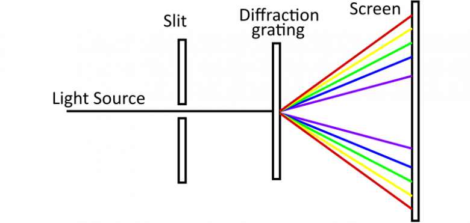
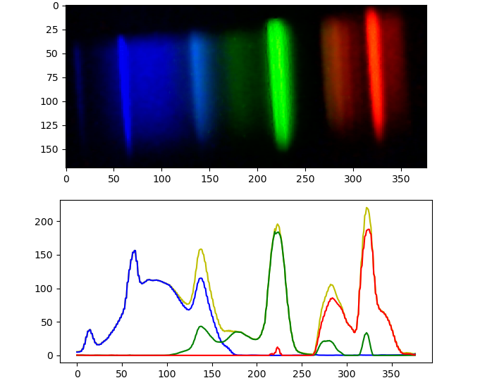

# DIY Spectrometer

This is my DIY spectrometer project. Its body is printed on a 3D printer, and the spectrum image is processed using a webcam and a Python script 
with `opencv` and `matplotlib`. An ordinary **DVD-R** disk was used to make the diffraction grating.

## How diffraction works

## How spectrum processing works

